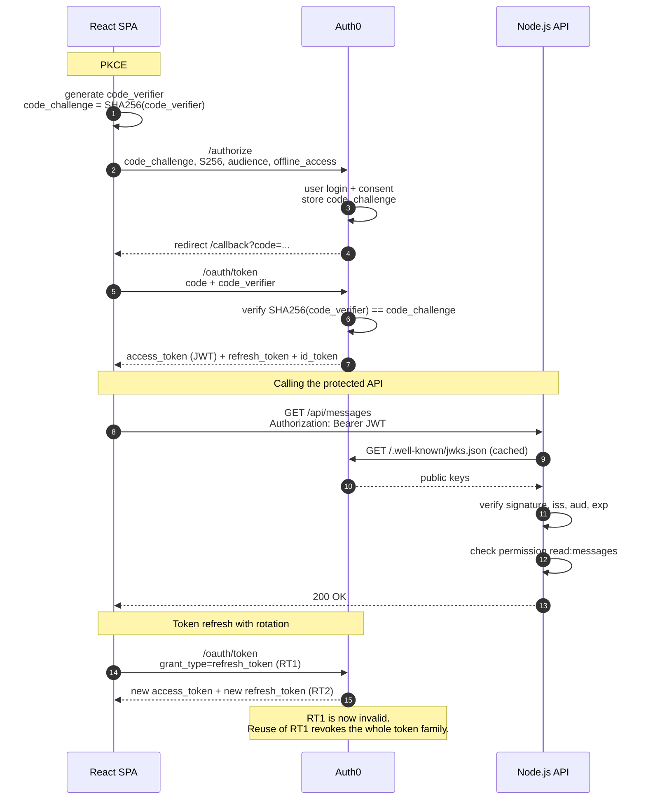

# oauth-fullstack

A full-stack reference implementation of **OAuth 2.0 Authorization Code Flow with PKCE**, **refresh token rotation** and **role-based access control** for a single-page application and a protected Node.js API.

The project focuses on security mechanics rather than UI: every step of the flow can be observed in the browser (Network tab, Local Storage) and verified against the backend.

---

## Features

- **Authorization Code Flow with PKCE** (S256) for a public SPA client, no client secret in the browser
- **Refresh tokens** with **rotation** and **reuse detection**
- **JWT access tokens** issued for a dedicated API audience
- **Backend JWT validation**: signature (RS256 via JWKS), issuer, audience, expiry
- **RBAC**: permissions embedded in the access token and enforced per endpoint
- Clear separation of **401 Unauthorized** (authentication) and **403 Forbidden** (authorization)

---

## Architecture

```
┌──────────────────┐        ┌──────────────────┐        ┌──────────────────┐
│  React SPA       │        │  Auth0           │        │  Node.js API     │
│  (Vite, :5173)   │◄──────►│  Authorization   │        │  (Express,:3001) │
│                  │        │  Server          │◄───────│                  │
│  auth0-react SDK │        │                  │  JWKS  │  JWT validation  │
│                  │────────────── Bearer JWT ─────────►│  + RBAC checks   │
└──────────────────┘        └──────────────────┘        └──────────────────┘
```

---

## Sequence Diagram



---

## Tech Stack

| Layer | Technology |
|---|---|
| Frontend | React, Vite, React Router, `@auth0/auth0-react` |
| Backend | Node.js, Express, `express-oauth2-jwt-bearer` |
| Identity Provider | Auth0 (Social login via GitHub, username/password) |
| Token format | JWT (RS256), JWKS-based key discovery |

---

## Security Concepts

| Threat | Mitigation in this project |
|---|---|
| Authorization code interception | PKCE (`code_challenge` / `code_verifier`, S256) |
| Stolen refresh token | Refresh token rotation with reuse detection |
| Forged or tampered tokens | RS256 signature verification against Auth0 JWKS |
| Token issued for another service | `aud` claim validated against the API identifier |
| Expired tokens | `exp` / `nbf` validation |
| Privilege escalation | RBAC permissions in the JWT, checked per route |
| Open redirect / code leakage | Exact `redirect_uri` allowlist in the authorization server |

### Authentication vs. Authorization

```
401 Unauthorized  → token missing or invalid        (who are you?)
403 Forbidden     → token valid, permission missing (what may you do?)
```

---

## API Endpoints

| Method | Endpoint | Protection | Response |
|---|---|---|---|
| GET | `/api/health` | none | service status |
| GET | `/api/user` | valid JWT | `sub`, `scope` |
| GET | `/api/messages` | JWT + `read:messages` | sample data |
| GET | `/api/admin` | JWT + `admin:access` | admin message |

---

## Project Structure

```
oauth-fullstack/
├── frontend/
│   ├── src/
│   │   ├── main.jsx              # Auth0Provider configuration
│   │   ├── App.jsx               # routes
│   │   ├── components/
│   │   │   ├── AuthButton.jsx    # login / logout
│   │   │   ├── Navbar.jsx
│   │   │   └── ProtectedRoute.jsx
│   │   └── pages/
│   │       ├── Home.jsx
│   │       ├── Callback.jsx      # handles the OAuth redirect
│   │       ├── Dashboard.jsx     # API calls, token refresh
│   │       └── Profile.jsx
│   └── .env.local
└── backend/
    ├── server.js                 # Express app, JWT + permission middleware
    └── .env
```

---

## Setup

### 1. Auth0 configuration

**Application** (type: Single Page Application)

| Setting | Value |
|---|---|
| Allowed Callback URLs | `http://localhost:5173/callback` |
| Allowed Logout URLs | `http://localhost:5173` |
| Allowed Web Origins | `http://localhost:5173` |
| Grant Types | Authorization Code, Refresh Token |
| Refresh Token Rotation | enabled, overlap period `0` |

**API**

| Setting | Value |
|---|---|
| Identifier (audience) | e.g. `https://oauth-fullstack-api` |
| Signing Algorithm | RS256 |
| Allow Offline Access | enabled |
| Enable RBAC | enabled |
| Add Permissions in the Access Token | enabled |
| Permissions | `read:messages`, `admin:access` |
| Application Access | SPA authorized for user-delegated access |

**Roles** (User Management → Roles)

| Role | Permissions |
|---|---|
| `user` | `read:messages` |
| `admin` | `admin:access` |

### 2. Environment variables

`frontend/.env.local`
```
VITE_AUTH0_DOMAIN=<your-tenant>.auth0.com
VITE_AUTH0_CLIENT_ID=<spa-client-id>
VITE_AUTH0_AUDIENCE=https://oauth-fullstack-api
VITE_BACKEND_URL=http://localhost:3001
```

`backend/.env`
```
AUTH0_DOMAIN=<your-tenant>.auth0.com
AUTH0_AUDIENCE=https://oauth-fullstack-api
FRONTEND_URL=http://localhost:5173
PORT=3001
```

No client secret is required: the SPA is a public client and relies on PKCE.

### 3. Run

```bash
# backend
cd backend
npm install
npm start

# frontend (second terminal)
cd frontend
npm install
npm run dev
```

Open `http://localhost:5173`.

---

## Verifying the Security Mechanisms

### PKCE

DevTools → Network → `/authorize` request. The query string contains:

```
code_challenge=<base64url>&code_challenge_method=S256
scope=openid profile email offline_access
audience=https://oauth-fullstack-api
```

### JWT contents

Copy `access_token` from Local Storage (`@@auth0spajs@@::...`) into a JWT decoder:

```json
{
  "iss": "https://<your-tenant>.auth0.com/",
  "aud": ["https://oauth-fullstack-api", "https://<your-tenant>.auth0.com/userinfo"],
  "scope": "openid profile email offline_access",
  "permissions": ["read:messages"]
}
```

### 401 vs. 403

```bash
# no token → 401
curl -i http://localhost:3001/api/admin

# invalid token → 401 with error="invalid_token"
curl -i http://localhost:3001/api/admin -H "Authorization: Bearer invalid"

# valid token without admin:access → 403 (use the Dashboard button)
```

### Refresh token reuse detection

1. Copy the current `refresh_token` from Local Storage (RT1).
2. Trigger a token refresh in the Dashboard. The app now holds RT2.
3. Replay RT1:

```bash
curl -s -X POST https://<your-tenant>.auth0.com/oauth/token \
  -H "Content-Type: application/json" \
  -d '{"grant_type":"refresh_token","client_id":"<spa-client-id>","refresh_token":"<RT1>"}'
```

Result: `invalid_grant`. A subsequent refresh with RT2 in the app fails as well, because the entire token family was revoked.

---

## Known Trade-offs

- **Tokens in Local Storage.** `cacheLocation="localstorage"` keeps the session across page reloads but makes tokens readable by JavaScript. The mitigations are refresh token rotation, short access token lifetimes and a strict Content Security Policy against XSS. A backend-for-frontend (BFF) with httpOnly cookies avoids browser token storage entirely.
- **Bearer tokens.** Any holder of a valid access token can use it until it expires. Sender-constrained tokens (DPoP, RFC 9449) bind tokens to a client key pair.
- **Permission changes are not instant.** Permissions are embedded in the JWT and only change when a new token is issued.

---

## Roadmap

- [ ] Security headers with `helmet` (CSP, HSTS, X-Frame-Options, Referrer-Policy)
- [ ] Strict CORS configuration review
- [ ] Content Security Policy for the SPA
- [ ] Backend-for-frontend variant with httpOnly cookies
- [ ] DPoP (sender-constrained tokens)

---

## References

- [RFC 6749 – OAuth 2.0](https://datatracker.ietf.org/doc/html/rfc6749)
- [RFC 7636 – PKCE](https://datatracker.ietf.org/doc/html/rfc7636)
- [RFC 6750 – Bearer Token Usage](https://datatracker.ietf.org/doc/html/rfc6750)
- [RFC 9449 – DPoP](https://datatracker.ietf.org/doc/html/rfc9449)
- [OAuth 2.0 for Browser-Based Apps (IETF draft)](https://datatracker.ietf.org/doc/draft-ietf-oauth-browser-based-apps/)
- [Auth0 – Authorization Code Flow with PKCE](https://auth0.com/docs/get-started/authentication-and-authorization-flow/authorization-code-flow-with-pkce)
- [PortSwigger Web Security Academy – OAuth](https://portswigger.net/web-security/oauth)

---

## License

MIT